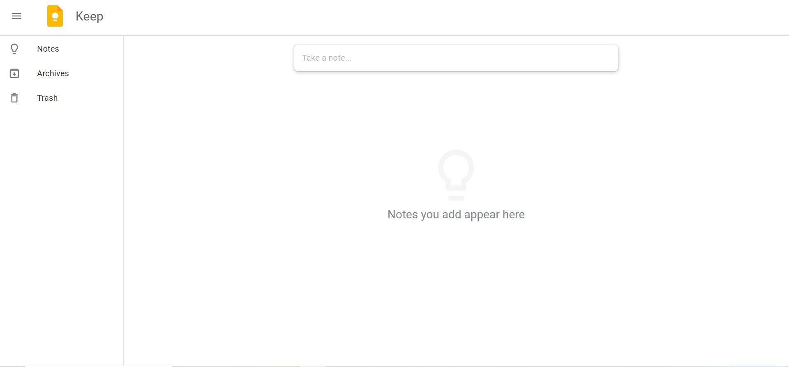

# Google Keep Clone - A Note-Taking Web Application



The **Google Keep Clone** is a simple and user-friendly note-taking web application that allows you to create, edit, and manage your notes effortlessly. With a clean and intuitive user interface, this project offers a convenient way to organize your thoughts and tasks.

## Features

- **Create Notes:** Easily create new notes with titles and content.
  
- **Edit and Delete Notes:** Modify the content or delete notes as needed.

- **Color Coding:** Assign different colours to your notes for better organization.

- **Responsive Design:** The application is responsive, ensuring a seamless user experience on various devices.

## Technologies Used

- **React:** The project is built using React, a powerful JavaScript library for building user interfaces.

- **CSS:** Custom CSS is used for styling the application and note cards.
  
- **Design FrameWork:** Material UI

- **LocalStorage:** Notes are stored in the browser's Local Storage, making them persist even after you close the app.

## Live Demo

Experience the live version of the Google Keep Clone at [Live Demo](https://aryan-prog.github.io/Google-Keep-Clone/).

## Installation & Usage

To run the project locally and explore its code, follow these simple steps:

1. Clone the repository:

   ```bash
   git clone https://github.com/aryan-prog/Google-Keep-Clone.git
   cd Google-Keep-Clone
   ```

2. Install dependencies:

   ```bash
   npm install
   ```

3. Start the development server:

   ```bash
   npm start
   ```

4. Open your web browser and visit [http://localhost:3000](http://localhost:3000) to use the Google Keep Clone locally.

## Motivation

This project serves as a testament to my passion for web development and showcases my ability to combine creativity with technical skills to create a visually captivating and functional portfolio.


## Contributing

Contributions to Google Keep Clone are welcome! If you have any ideas, suggestions, or improvements, please feel free to open an issue or submit a pull request.


The **Google Keep Clone** exemplifies my dedication to presenting my skills and experiences in a creative and engaging manner. I hope this project provides a comprehensive and impressive representation of my capabilities as a software developer. Thank you for visiting my portfolio website! If you have any questions or would like to get in touch, please feel free to contact me at [seth.aryan605@gmail.com](mailto:seth.aryan605@gmail.com). Happy coding!

## Future Prospects
Trying to add a popup notes component to edit notes

